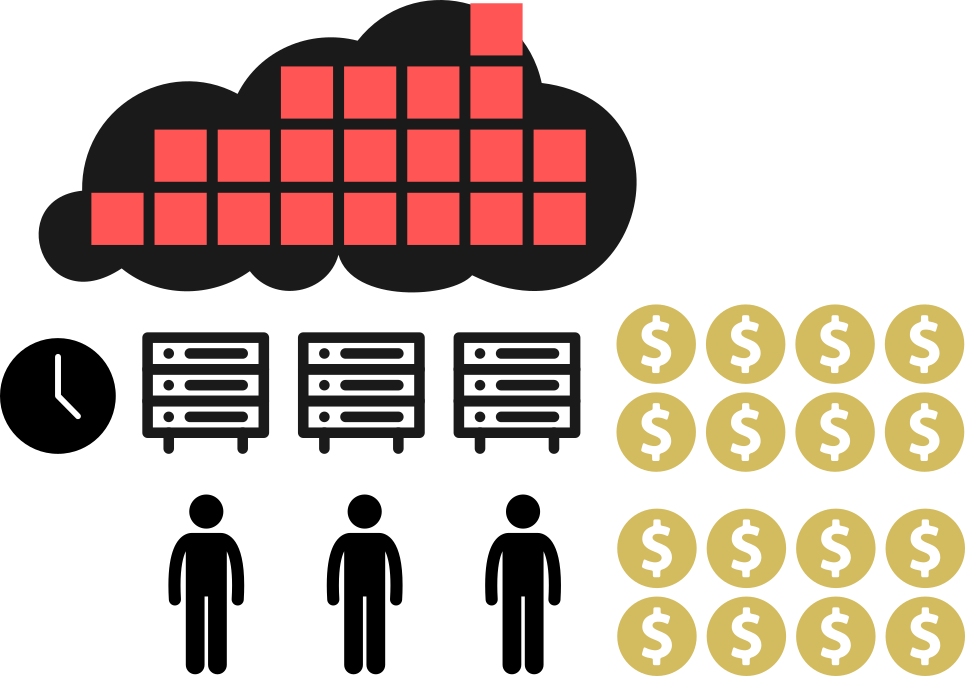
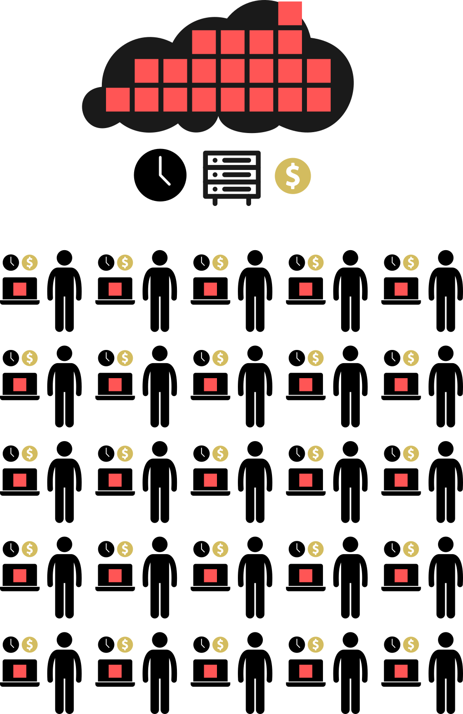
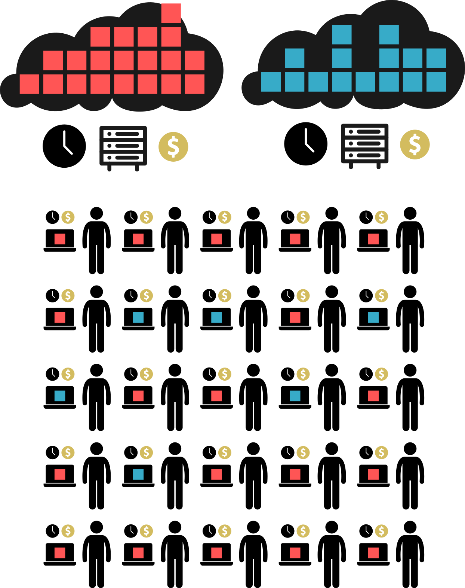
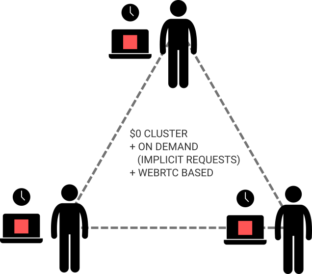

# Lakey - Goal & Overview

## Problem with Data Lake and Myth of Big Data

- Big Data revolution promised to deliver a technology that will enable **Data Drived Decision Making**
- But that's not for reality brings since: Big Data Approach suffers the following issues:
    - expensive clusters for computation (INFRASTRUCTURE COST PROBLEM)
    - each query takes from minutes to hours therefore LIMITS amount of INSIGHTS that could be created during working hours of researcher (SLOW FEEDBACK LOOP PROBLEM)
    - cost problem make insights discovery problematic since each research must be planned in advance in order no to waste resouces, which prevents any spontanous insights discovery (PLANNING PROBLEM)
    - doing Machine Learning on Big Data is a bit problematic since not being able to understand fully the data, having slow feedback loop makes it almost impossible to consider richness of potential Machine Learning methods that may be tried out.

## Lakey approach to Data Lake

Lakey address all of the above issue:

## Expanded Lakey approach to Data Lake

Lakey could be easily expanded by extra data without going too much into corporate decision making process:

## What if you resources are not enough (cluster is needed!)

Lakey produces by default Pandas DataFrames but it could be made to produce Dask DataFrame which would use all available cores or if that's not enough Dask Distributed DataFrame where each extra node could be requested from known Peers:

