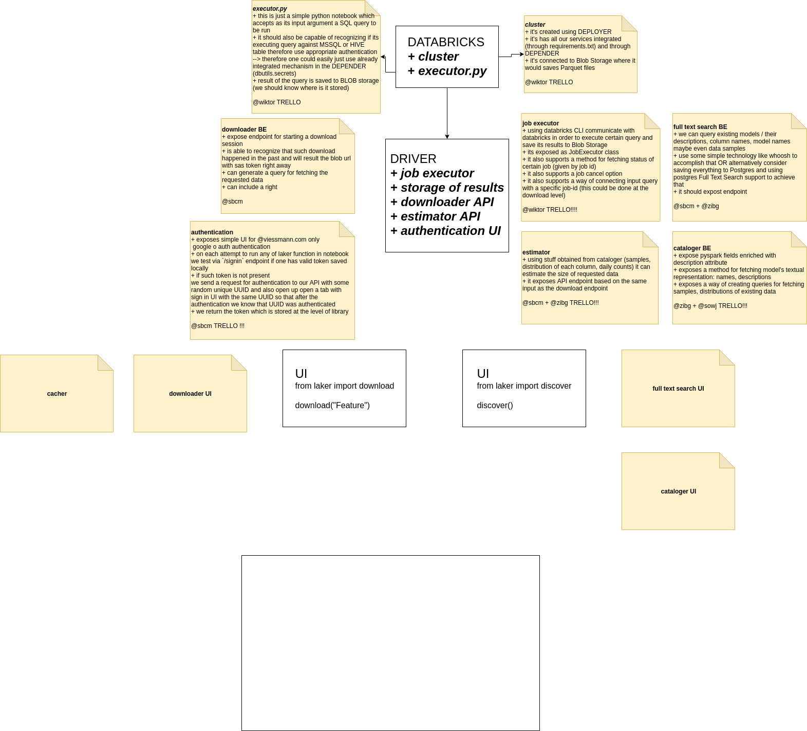

# Laker

Is a project allowing huge amount of people (clients) to connect with expensive Data Lakes in order to download data to their local machines which will allow rapid prototyping of data driven algorithms and applications.

## The Goal

Laker was built and designed with one goal in mind: "to free up the data, which are otherwise sitting idle and just being covered in dust".

## Installation

```bash
make install
source .venv/bin/activate
```

## Running development server

```bash
make start_dev_server port=8889
```

## Running grok

In order to test the authentication while still developing locally one can use `ngrok` proxy which will expose the locally running service over the web.

In order to start such a process one can run:

```bash
make start_ngrok
```

## Architecture

[](https://www.draw.io/#G1zrMb3J6eeFVEmbUvT6ETs240ZzVe4eAy)

### Auth Token Management - who is who

[ ] FIXME: add diagram to describe the FLOW here!!!!

### Catalogue - discovery of data

...

### Downloader - efficient data download

...
