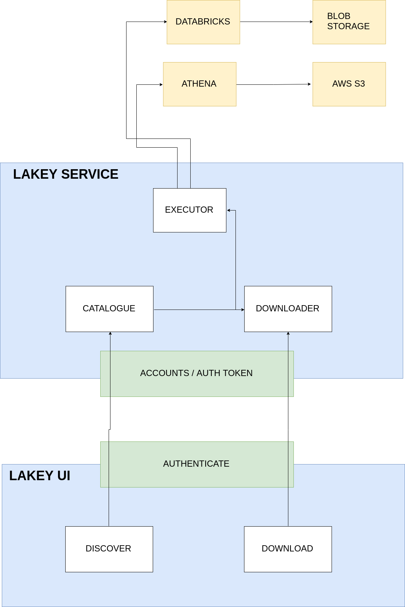
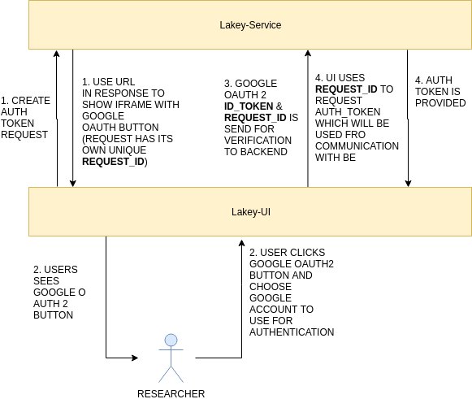

[](https://travis-ci.org/cosphere-org/lakey-service)

# Lakey-Service

Is a project allowing huge amount of people (clients) to connect with expensive Data Lakes in order to download data to their local machines which will allow rapid prototyping of data driven algorithms and applications.

## The Goal

Lakey was built and designed with one goal in mind: "to free up the data, which are otherwise sitting idle and just being covered in dust".

To learn more read high level overview regarding the [Big Data Myths](https://github.com/cosphere-org/lakey-service/blob/master/LAKEY.md)

Before one starts working with `Lakey-Service` two files must be obtained over secured channel: `ngrok_private.yaml` and `env_private.sh` (please reach author for them).

## Setting Up for the Development

### Installation

Create virtulenv and install all requirements by calling:

```bash
make install
source .venv/bin/activate
```

### Setting up the Database

Before you start one must create & start a dockerized database

```bash
make create_db
```

When development is done one can stop that database:

```bash
make stop_db
```

When development is on again one can easily start db by calling:

```bash
make start_db
```


### Running development server

```bash
make start_dev_server port=8889
```

### Running grok

In order to test the authentication while still developing locally one can use `ngrok` proxy which will expose the locally running service over the web.

In order to start such a process one can run:

```bash
source env.sh && \
ngrok start --config ngrok_private.yaml --region eu lakey-<your-name>
```

## Setting up Accounts and Tokens

### Creating ADMIN account

```bash
source env.sh && \
python lakey_service/manage.py create_account johnny@where.com --type ADMIN
```

### Creating RESEARCHER account

```bash
source env.sh && \
python lakey_service/manage.py create_account jacky@where.com
```

### Creating auth token for a given account
```bash
source env.sh && \
python lakey_service/manage.py create_auth_token johnny@where.com
```

## Creating Fake Catalogue Items

Inside `lakey_service/catalogue/management/commands/items/` catalogue one can find example yaml files describing the fake catalogue items. One can use them directly or based on them generate own fake catalogue items.

For the management of those fake catalogue items there are two commands at hand:

```bash
make create_fake_catalogue_items
```

which will create catalogue items if they do not exist yet (using the `name` to determine their existence) or do nothing.

And 2nd command:
```bash
make create_fake_catalogue_items_with_overwrite
```

which will either create catalogue items or overwrite existing ones if anything with regards to their spec or sample changed.

## DOCS

### Architecture

[](https://www.draw.io/#G10wj4nSI7JHLVParPvdDMrLe4CMT4Vg6r)

### Auth Token Management - who is who

[](https://www.draw.io/#G10wj4nSI7JHLVParPvdDMrLe4CMT4Vg6r)

### Catalogue - discovery of data

https://github.com/cosphere-org/lakey-service/blob/master/.lily/API.md#catalogue-items-management

### Downloader - efficient data download

https://github.com/cosphere-org/lakey-service/blob/master/.lily/API.md#download-requests-management
